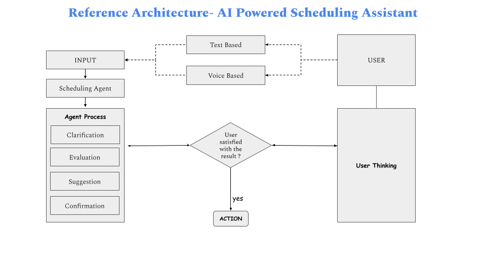

# scheduler

## 🤖 AI-Powered Scheduling Assistant

A multi-agent AI system that interacts with Google Calendar to **create**, **display**, **update**, and **delete** events — just like a human assistant. Powered Gemini for voice and text based conversational scheduling.

---

### 🚀 Features

- 🗓️ Add, view, update, and delete calendar events
- 🎤 Voice-based interaction support
- 🧠 Conversational agent powered by Gemini
- 🔗 Google Calendar API integration

---

### 🛠️ Tech Stack

- `PhiData`
- `Gemini` (via Google Generative AI)
- `Google Calendar API`
- `Python`, `Streamlit`
- `SpeechRecognition`, `TTS using Gemini`

---

### ⚙️ Installations

```bash
https://github.com/rrahulg/scheduler.git
cd scheduler
python -m venv venv
venv/Scripts/activate
pip install -r requirements.txt
```

```ini
make sure you have .env file containing
GEMINI_API_KEY = your_gemini_api_key
PHIDATA_API_KEY= your_phi_api_key (optional)
```

```
⚠️ This project uses Google Calendar API.
To test it, please create your own OAuth 2.0 credentials:

1. Go to https://console.cloud.google.com/
2. Create a new project (or use an existing one).
3. Enable the Google Calendar API.
4. Create OAuth 2.0 Client ID (choose "Desktop App").
5. Download the `client_secret.json` file.
6. Place it in the project root before running the project.
```

---

### 🧠 Refrence Architecture

## 

### 🚀 Run the app

```cmd
streamlit run .\app.py
```
